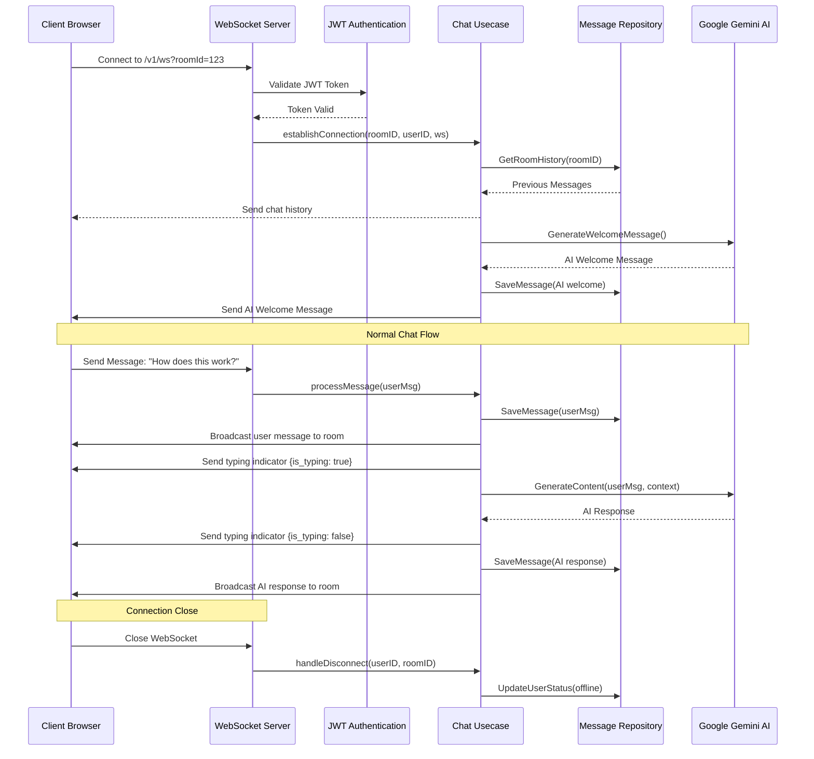

# Go Secure Backend Service with Clean Architecture & AI Chat

This project is a secure, high-performance, and maintainable RESTful API built in Golang using the Echo framework. It demonstrates the principles of Clean Architecture, SOLID, and Clean Code, with a focus on robust authentication, separation of concerns, and real-time chat integration with Google Gemini.

## Features

-   **User Management:** Core CRUD functionality for a User entity.
-   **Real-time Chat:** WebSocket-based chat rooms.
-   **AI Integration:** Chat responses are powered by Google Gemini.
-   **Secure Endpoints:**
    -   **JWT Authentication:** Protects user-specific endpoints, including WebSocket connections.
    -   **Basic Authentication:** Protects administrative or internal endpoints.
-   **Clean Architecture:** A clear separation between business logic and framework-specific code.
-   **Dependency Injection:** Interfaces are used to decouple layers, managed in a central `bootstrap` package.
-   **Configuration Management:** Centralized configuration loaded from environment variables (`.env` supported).
-   **Makefile:** Simplified commands for running, building, and managing the project.

## Architecture

This project follows the principles of **Clean Architecture**. The dependencies flow inwards, from the outer layers (frameworks, UI) to the inner layers (business logic, entities).

```
+-----------------------------------------------------------------+ 
|                            Frameworks                           |
| +-------------------------------------------------------------+ | 
| |                          Handlers                           | | 
| | +---------------------------------------------------------+ | | 
| | |                         Usecases                        | | | 
| | | +-----------------------------------------------------+ | | | 
| | | |                      Entities                       | | | | 
| | | +-----------------------------------------------------+ | | | 
| | +---------------------------------------------------------+ | | 
| +-------------------------------------------------------------+ | 
+-----------------------------------------------------------------+
```

-   **Domain/Entities (`internal/.../domain.go`):** The core of the application. Contains the data structures and the interfaces for repositories and use cases. This layer has no dependencies on any other layer.
-   **Repository (`internal/.../repository_mongo.go`):** Implements the repository interface defined in the domain. It is responsible for all data persistence logic, communicating directly with the database (MongoDB).
-   **Usecase (`internal/.../usecase.go`):** Implements the use case interface. It contains the core business logic of the application (e.g., user creation, login, handling a chat stream). It orchestrates data flow between repositories and other services.
-   **Handler (`internal/.../handler.go`):** This layer is responsible for handling HTTP/WebSocket requests. It parses requests, calls the appropriate use case, and formats the response. It is the bridge between the framework and the business logic.
-   **Main (`cmd/server/`):** The entry point of the application. It is responsible for initializing all the components (bootstrap), setting up the router, and starting the server.

## Chat Flow (Mermaid Diagram)

This diagram illustrates the sequence of events during a chat session with AI integration.



## API Endpoints

| Method | Path              | Authentication | Description                  |
|--------|-------------------|----------------|------------------------------|
| `POST` | `/v1/login`       | Public         | Authenticate and get a JWT.  |
| `POST` | `/v1/users`       | Basic Auth     | Create a new user.           |
| `GET`  | `/v1/users/:id`   | JWT            | Get a user by their ID.      |
| `GET`  | `/v1/ws`          | JWT            | Connect to the chat WebSocket. Requires `roomId` as query param. |

## Getting Started

### Prerequisites

-   Go 1.18 or higher
-   `make`
-   A running MongoDB instance.

### Installation

1.  Clone the repository:
    ```bash
    git clone https://github.com/gemini-cli/portfolio-chat-ai-go.git
    cd portfolio-chat-ai-go
    ```

2.  Create a `.env` file in the root of the project and fill in the required variables. You can use `.env.example` as a template.

3.  Tidy the dependencies:
    ```bash
    make tidy
    ```

### Running the Application

To run the application, use the following command:

```bash
make run
```

The server will start on the port specified in your `.env` file (e.g., `http://localhost:8080`).

## Project Structure

```
.
├── .env.example
├── .gitignore
├── Makefile
├── README.md
├── cmd
│   └── server
│       ├── main.go
│       └── router.go
├── go.mod
├── go.sum
├── internal
│   ├── chat
│   │   ├── domain.go
│   │   ├── handler.go
│   │   ├── repository_mongo.go
│   │   └── usecase.go
│   └── user
│       ├── domain.go
│       ├── handler.go
│       ├── repository.go
│       ├── repository_mongo.go
│       └── usecase.go
└── pkg
    ├── bootstrap
    │   └── bootstrap.go
    ├── config
    │   └── config.go
    ├── database
    │   └── mongo.go
    ├── gemini
    │   └── client.go
    └── middleware
        ├── auth.go
        ├── integration.go
        └── integration_ai.go
```

-   **`cmd/server`**: Entry point and router setup.
-   **`internal`**: Core business logic, separated by domain (`user`, `chat`).
    -   `domain.go`: Defines structs and interfaces.
    -   `handler.go`: HTTP/WebSocket handlers.
    -   `usecase.go`: Core business logic layer.
    -   `repository_mongo.go`: MongoDB repository implementation.
-   **`pkg`**: Shared packages used across the application.
    -   `bootstrap`: Application startup logic (DB connections, etc.).
    -   `config`: Configuration loading.
    -   `database`: DB connection helpers.
    -   `gemini`: Client for interacting with the Google Gemini API.
    -   `middleware`: Custom Echo middleware (JWT, Basic Auth, etc.).